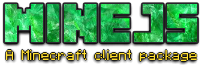
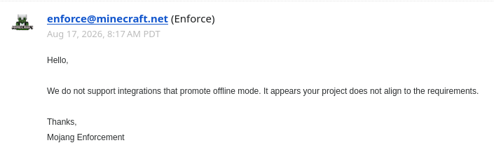

<div style="width: 100%; display: flex">
    
</div>

## I. Introduction

This is a Minecraft client package, written entirely in Typescript, using NodeJS `node:net` to communicate with Minecraft server. Currently support 26.2.

### DISCLAIMER

This package is highly unstable for now, please report if there is any bug, glitch.

Also, since there is some problem with authenticating and appId approval, I haven't completed the join "online server" part yet. [See more here](#iv-about-joining-online-server)

## II. Usage

Install MineJS using your favorite package manager:

```bash
npm install @vaitosoi/minejs
```

Then write a simple code like this:

```typescript
// index.ts
import { Input, Client } from "@vaitosoi/minejs";

const client = new Client({
    playerName: "bot",
    host: "localhost",
    port: 25565,
    version: "26.2",
    loadRegistry: false,
    // auth: {
    //     client_id: "d86254d8-edf7-4640-90eb-643c99af188e",
    //     method: "loopback",
    //     openBrowser: true,
    //     port: 12345
    // },
    // shouldVerifyMessageOrder: true,
    // shouldVerifyMessageSignature: true
});
client.connect();
client.on("disconnect", (...args) => console.dir({ name: "disconnect", args }, { depth: null }));
client.on("disconnectRaw", (...args) => console.dir({ name: "disconnectRaw", args }, { depth: null }));
// client.on("loadChunk", (...args) => console.dir({ name: "loadChunk", args }, { depth: null }));
// client.on("unloadChunk", (...args) => console.dir({ name: "unloadChunk", args }, { depth: null }));
// client.on("spawnEntity", (...args) => console.dir({ name: "spawnEntity", args }, { depth: null }));
// client.on("updateEntity", (...args) => console.dir({ name: "updateEntity", args }, { depth: null }));
// client.on("removeEntity", (...args) => console.dir({ name: "removeEntity", args }, { depth: null }));
client.on("playerPosition", (...args) => console.dir({ name: "playerPosition", args }, { depth: null }));
client.on("message", (...args) => console.dir({ name: "message", args }, { depth: null }));
client.on("systemMessage", (...args) => console.dir({ name: "systemMessage", args }, { depth: null }));
client.on("systemMessageRaw", (...args) => console.dir({ name: "systemMessageRaw", args }, { depth: null }));
client.on("actionBar", (...args) => console.dir({ name: "actionBar", args }, { depth: null }));
client.on("actionBarRaw", (...args) => console.dir({ name: "actionBarRaw", args }, { depth: null }));
client.on("message", (message) => {
    if (!message.content.startsWith("_")) return;
    const args = message.content.slice(1).split(" ");
    switch (args[0]) {
        case "w": client.hold(Input.Forward); break;
        case "sw": client.release(Input.Forward); break;
        case "ws":
            client.hold(Input.Forward);
            setTimeout(() => client.disconnect(), 2000);
            break;
        case "s": client.hold(Input.Backward); break;
        case "ss": client.release(Input.Backward); break;
        case "a": client.hold(Input.Left); break;
        case "sa": client.release(Input.Left); break;
        case "d": client.hold(Input.Right); break;
        case "sd": client.release(Input.Right); break;
        case "j": client.hold(Input.Jump); break;
        case "sj": client.release(Input.Jump); break;
        case "run": client.hold(Input.Sprint); break;
        case "srun": client.release(Input.Sprint); break;
        case "stop": client.stopMoving(); break;

        case "at": {
            const [, x, y, z] = args.map(val => parseInt(val)) as [any, number, number, number];
            const state = client.at(x, y, z);
            console.log(state);
            break;
        }

        case "e":
        case "echo":
        case "say": {
            const message = args.slice(1).join(" ");
            client.chat(message);
            break;
        }

        case "disconnect":
        case "exit":
            client.disconnect();
            break;
    }
});
```

And run it:

```
npm tsx index.ts
```

## III. API:

See [documentation](https://minejs.vaito.dev)

## IV. About joining online server:

### 1. What is `online server` and `offline server`:

+ `Offline server` is a server you can join with a cracked account, meaning that you don't have to own Minecraft to join.

+ `Online server`, on the other hand, require an account that owns Minecraft.

### 2. Why I can't join online server yet:

In order to join "online server", the client has to send some request to Minecraft server, which require an approved Azure App (more info in [here](https://minecraft.wiki/w/Microsoft_authentication#Microsoft_OAuth2_flow) and [here](https://help.minecraft.net/hc/en-us/articles/16254801392141p)), which I don't have at the moment. So I can not fully test the "join online server" feature right now. 

### 3. So how do you know if the server is offline or online:

#### a. If you are the server owner:

Check your `server.properties` file:

```
...
motd=A Minecraft Server
network-compression-threshold=256
online-mode=false # <- false is offline, true is onlune
op-permission-level=4
pause-when-empty-seconds=60
...
```

#### b. If you are not the server owner:

1. Ask the server owner

or

2. Try some crack launcher to join that sevrer

### 4. Note:

But still, if you somehow got an approved app and found some bug, please [create a issue](https://github.com/VaitoSoi/minejs/issues/new)

**P/s:** They rejected me 😭

